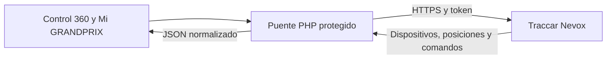

# GRANDPRIX ↔ Traccar en producción

La V6 usa un puente PHP de servidor a servidor. El navegador consulta únicamente `api/traccar.php`; la URL privada y la credencial se agregan en el servidor y nunca se incorporan al HTML ni al JavaScript.

## Configuración entregada

| Parámetro | Valor operativo |
|---|---|
| Servidor | `https://traccar.nevox.pro` |
| Autenticación | Query string `?token=` |
| Intervalo | 5 segundos |
| Entorno | Producción obligatorio |
| Comandos | Compatibilidad dinámica por Device ID |
| Portal cliente | Sólo la unidad asignada por el servidor |
| Contingencia | Diagnóstico visible, sin datos simulados |

El token ya está en `config/traccar.php` y registra vencimiento el **31 de agosto de 2026 a las 04:00 UTC**. Reemplázalo antes de esa fecha desde `install/conectar-traccar.php`.

## Endpoints internos

| Acción | Método | Protección | Uso |
|---|---:|---|---|
| `?action=status` | GET | Administrador | Estado, equipos en línea y vencimiento del token |
| `?action=fleet` | GET | Administrador | Dispositivos y última posición normalizada |
| `?action=customer-position` | GET | Cliente/administrador | Sólo el GPS asignado a la sesión |
| `?action=groups` | GET | Administrador | Grupos de Traccar |
| `?action=geofences` | GET | Administrador | Geocercas de Traccar |
| `?action=route` | GET | Administrador | Recorrido real con rango máximo de 31 días |
| `?action=command-types` | GET | Administrador | Comandos del Device ID y canal seleccionado |
| `?action=command` | POST | Administrador + CSRF | Despacho validado a Traccar |
| `?action=command-audit` | GET | Administrador | Últimas 20 órdenes registradas |

## Normalización de telemetría

- Convierte la velocidad de nudos a km/h.
- Expone latitud, longitud, altitud, rumbo, precisión y dirección textual.
- Expone ignición, movimiento, batería, señal, satélites, alarma y odómetro cuando están presentes en `attributes`.
- Conserva la hora de fijación y la última comunicación del dispositivo.
- Nunca completa un campo ausente con un valor inventado; la interfaz muestra “Sin dato”.

## Centro de comandos

La interfaz consulta `GET /api/commands/types?deviceId=...&textChannel=...` y construye las tarjetas en tiempo real. Por eso cada GPS puede mostrar una lista diferente. Entre los tipos que la UI sabe presentar están:

- Posición única, reporte periódico y fin de reporte.
- Apagado y restauración de motor.
- Activación/desactivación de alarma.
- Reinicio, apagado del GPS y consulta de estado/versión.
- Odómetro, zona horaria, salidas, SMS, USSD y conexión.
- Comando personalizado, si está habilitado expresamente.

Antes de enviar, el backend vuelve a consultar la compatibilidad para impedir que una modificación del navegador fuerce una orden no disponible. También limita órdenes consecutivas, valida atributos y registra la ejecución.

### Regla especial de apagado

`engineStop` sólo se envía cuando existe una posición y la velocidad normalizada es igual o inferior a 1 km/h. Esta comprobación reduce el riesgo operativo, pero no sustituye el protocolo interno de autorización de GRANDPRIX.

## Lista de comprobación en Hostinger

1. Extraer el ZIP dentro de `public_html/grandprix`.
2. Comprobar que `https://tudominio.com/grandprix/config/traccar.php` responda 403.
3. Iniciar sesión y abrir `install/conectar-traccar.php`.
4. Ejecutar la prueba de conexión y confirmar los equipos detectados.
5. Asignar el Device ID exacto a Yeivert Sánchez.
6. Revisar Monitoreo en vivo; un equipo sin posición debe aparecer como tal, no en el mapa.
7. Abrir Centro de comandos y comparar datos GPRS frente a SMS.
8. Probar primero `positionSingle` con un GPS controlado.
9. Probar acciones sensibles sólo con la motocicleta detenida y personal autorizado.
10. Regenerar el token compartido y actualizarlo antes del 31/08/2026.

## Referencias oficiales

- [API de Traccar](https://www.traccar.org/traccar-api/)
- [Comandos de Traccar](https://www.traccar.org/commands/)
- [Especificación OpenAPI](https://github.com/traccar/traccar/blob/master/openapi.yaml)

